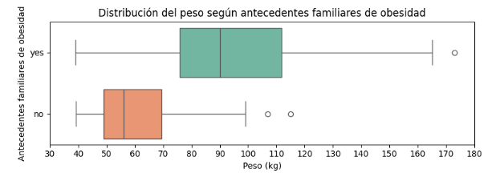
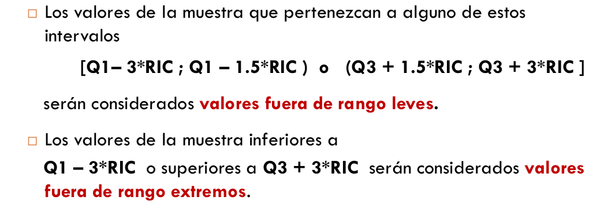

### Ejercicio 1
Atributos a analizar del dataset Obesity
- Gender  CN
- Age     CD
- Height  CC
- Weight  CC
- Family_history_with_overweight CO
- FAVC  CO
- FCVC  CC
- NCP   CD
- CAEC  CN
- SMOKE CO
- CH2O  CC
- SCC   CO
- FAF   CC
- TUE   CC
- CALC  CN
- MTRANS CN
- NObesity(target)

Tipo de atributo         | Cantidad
------------------------ | --------
cuantitativo discreto CD |    2
cuantitativo continuo CC |    6
cualitativo nominal   CN |    4
cualitativo ordinal   CO |    4

### Ejercicio 2
#### Proponga una tarea de clasificación y una tarea de regresión que puedan realizarse a partir de los datos del dataset de obesidad.
En este ejercicio lo que se busca es elegir el tipo de variable objetivo.
- Clasificación → La salida del modelo es una variable cualitativa
- Regresión → La salida del modelo es una variable cuantitativa

Una tarea de Clasificación puede ser clasificar a las personas segun su nivel de obesidad (alto, medio, bajo) a partir de los distintos atributos que tenemos.
Una tarea de Regresión puede ser predecir el indice de masa corporal (IMC) o el peso exacto de una persona a partir de los distintos atributos que tenemos.  

### Ejercicio 3
#### Indique qué tipo de información brindan las siguientes representaciones gráficas: 
- **a. Diagrama de Barras**  
  - <u>Funcionamiento:</u>
    - Cada categoría (variable cualitativa) se representa con una barra.
    - La altura o longitud de la barra indica la frecuencia absoluta, relativa o un valor agregado (ejemplo: promedio de ingresos por categoría).
  - <u>Características clave:</u>
    - El eje X (horizontal) suele mostrar las categorías.
    - El eje Y (vertical) muestra la magnitud o frecuencia.
  - <u>Cuándo usarlo:</u> Para comparar fácilmente grupos o categorías.
    - Ejemplo: comparar la cantidad de hombres y mujeres en un estudio de obesidad.

- **b. Histograma** 
  - <u>Funcionamiento:</u>
    - Divide el rango de valores de una variable numérica en intervalos o "bins".
    - Cada barra representa la cantidad de observaciones que caen dentro de ese intervalo.
  - <u>Características clave:</u>
    - Se parece a un diagrama de barras, pero aquí los datos son continuos.
    - No hay espacios entre las barras porque representan un rango de valores contiguos.
    - Permite ver la forma de la distribución (simétrica, sesgada, uniforme, con colas largas).
  - <u>Cuándo usarlo:</u> Para analizar la distribución de una variable cuantitativa.
    - Ejemplo: distribución de IMC en una población.

- **c. Diagrama de caja**  
  - <u>Funcionamiento:</u>
    - Resume los datos numéricos mostrando sus cuartiles:
      - Caja → va del Q1 (25%) al Q3 (75%).
      - Línea dentro de la caja → mediana (Q2, 50%).
      - "Bigotes" → valores mínimo y máximo sin ser atípicos.
      - Puntos fuera de los bigotes → outliers (valores atípicos).
  - <u>Características clave:</u>
    - Excelente para comparar la variabilidad de varios grupos.
    - Ayuda a detectar asimetría y outliers rápidamente.
  - <u>Cuándo usarlo:</u> Para ver la dispersión y los valores extremos en una variable.
    - Ejemplo: comparar la distribución de pesos entre hombres y mujeres.

- **d. Diagrama de dispersión** 
  - <u>Funcionamiento:</u>
    - Cada observación se representa como un punto en un plano cartesiano, donde el eje X es una variable y el eje Y otra.
  - <u>Características clave:</u>
    - Muestra tendencias lineales o no lineales.
    - Permite detectar correlación: positiva (suben juntas), negativa (una sube y la otra baja), o ausencia de relación.
    - También revela agrupamientos (clusters) o valores atípicos.
  - <u>Cuándo usarlo:</u> Para estudiar la relación entre dos variables cuantitativas.
    - Ejemplo: ver cómo varía el peso en función de la altura.

Luego, genere al menos un ejemplo de cada representación usando el dataset de obesidad y explique cómo interpretar cada uno. 

### Ejercicio 4
#### Complete el siguiente cuadro y dibuje el diagrama de caja del atributo “weight” 
Medida                                    | Valor
----------------------------------------- | -------- 
Mínimo                                    |   
Máximo                                    |   
Q1                                        |   
Q2 o mediana                              |   
Q3                                        |   
RIC                                       |   
Bigote superior                           |   
Bigote inferior                           |   
Intervalos de valores atípicos leves      |   
Valores atípicos leves                    |   
Intervalos de valores atípicos extremos   |   
Valores atípicos extremos                 |   

### Ejercicio 5
#### Los valores del atributo peso (“weight”) fueron agrupados según el atributo de antecedente de obesidad familiar (“family_history_with_overweight”). La figura muestra los diagramas de caja correspondientes. 

Complete el siguiente cuadro y responda verdadero o falso justificando cada afirmación según los valores obtenidos:

Medida              |   yes   |   no   |
------------------- | ------- | ------ | 
Mínimo              |   ~40   |  ~40   |
Máximo              |   ~175  |  ~115  |
Q1                  |   ~78   |  ~49   |
Q2                  |   ~90   |  ~56   |
Q3                  |  ~115   |  ~57   |
RIC                 |  Q3-Q1  |  Q3-Q1 |
Bigote Inferior     |   40    |   40   |
Bigote Superior     |  ~165   |  ~100  |
 
- a. Al menos el 25% de las personas con antecedentes familiares de obesidad pesan más de 100 kg.
  - VERDADERO, acá vemos que Q3 ~115 y de esto podemos deducir que el ultimo cuartil corresponde completamente a personas que pesan más de 100kg
- b. Es atípico que una persona sin antecedentes familiares de obesidad (no) pese más de 115 kg.
  - VERDADERO, acá vemos que el máximo se da por un valor atípico de ~115
- c. La mediana del peso de las personas sin antecedentes familiares (no) es menor que 60 kg. 
  - VERDADERO, la mediana (Q2) de peso de las personas sin antecedentes familiares es menor a 60kg (~56)
- d. Todos los valores atípicos para personas con antecedentes familiares de obesidad son leves.
  - VERDADERO, para esto verificamos en este caso con la fórmula para encontrar valores atípicos extremos, (Q3+3*RIC) = 115+3*37 = 226, y como el valor máximo es 173 no se considera un valor atípico extremo
    

### Ejercicio 6 
#### Discretice el atributo del consumo de agua diario en litros (“CH2O”) en tres intervalos: Bajo, Medio y Alto. Indique en la tabla los intervalos utilizados y la cantidad respectivas de ejemplos de cada uno al discretizar por rango y por intervalo. Luego, explique porque los ejemplos no quedaron divididos en intervalos con la misma cantidad de valores. 

### Ejercicio 7

### Ejercicio 8

### Ejercicio 9

### Ejercicio 10

